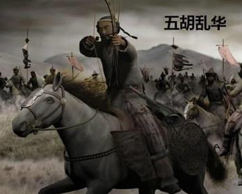

# 神州陆沉

公元304年\~439年，历经八王之乱，西晋失去了对天下的控制权，塞外游牧民族趁西晋末年八王之乱，陆续建立起非汉族政权，形成与南方汉人对峙的局面。包括匈奴、鲜卑、羯、羌、氐五大胡人部落，史称五胡乱华，掀开了中国历史上最黑暗血腥的一面。

\

\

中原地区沦丧于胡人之手，南方东晋的爱国将士祖逖、庾亮、殷浩、桓温、刘裕等英雄的多次举旗北伐中原，五胡乱华战乱连连，堪称是汉民族一场灾难，几近亡种灭族，史称为“永嘉之乱、神州陆沉”。
