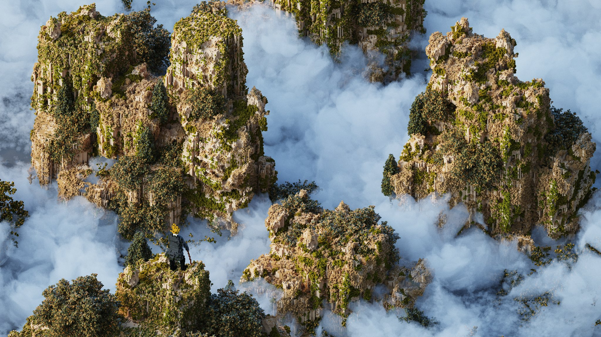
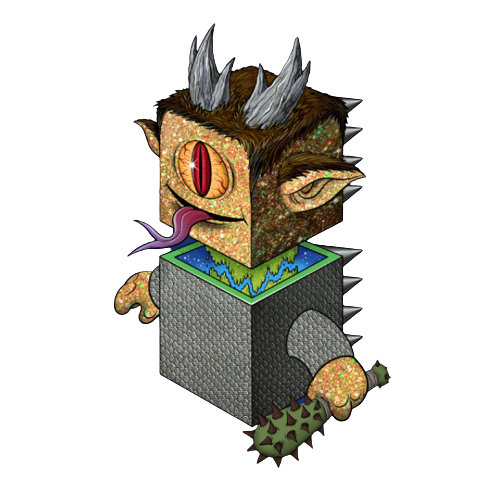

# 蜀山初现

夜色微凉，大营中帐传来冉闵将军的一声断喝："胡人畏威而不怀德，我意已决，《杀胡令》檄文天下，戎狄豺狼，天下英雄共诛之！"

众将领高声应喝，白眉默然而立，不再做声，片刻之后弯腰一拜，缓缓退出统帅大帐。

白眉是武将，长的面如冠玉，身材挺拔，看起来就似一位玉树临风的白衣书生。

他抬头看了看月色，双眼映照着月光闪闪发亮，便走到马厩牵出一匹黑色快马，打了声招呼出了守卫营，快马加鞭向瓦屋山麓狂奔而去。

今夜月色如银，一人一马如同闪电，跑的极快，不长时间就来到了瓦屋山麓，一片巨石岩壁前。

马儿还未停稳，白色身影就从马背上一跃而起，顺着岩壁缝隙向上攀援而去，一会儿功夫，白眉就爬到岩壁高处一道隐约的黑色裂缝处，稍作停留，忽然闪身不见...

这是一个天然岩洞，开口处极窄，白眉慢慢往前挪动着，走了大约3\~4米，忽的脚下一空，身体顺势往前蹲下，顺势滑入到一个巨大卵状空间中。

半个月前，白眉在这悬崖绝壁之上，无意发现了此处洞穴，感觉处处透着玄机，不知道是什么上古先人开凿了此处空间，或许是个修炼之所。

滑到石室中央缓缓站稳后，黑暗中稍作停留，双眼便渐渐适应了环境。

向前看去，隐约看到中间地面，有一抹流动的紫荧光略明略暗。白眉顿时觉得非常奇怪，上次来时在白天，洞口斜射入的阳光柱透着轻尘飞舞，没有任何异样，今天却发现如此怪异闪动的紫光，白眉缓缓摸到光芒前坐下，小心的观察着流动的淡紫色光芒，只见光芒下隐约浮现这一个黑色方块的轮廓，方块表面有凸起黑色符文若影若现。

白眉默默的注视着方块，下意识的伸手去轻轻试探荧光。

眨眼间，手指就摸到方块上的凹凸不平的符文。

白眉摸到了一处圆形的小凹槽，便试着用食指探入，稍一用力，就感觉到有几枚尖刺，指尖传来一阵轻轻刺痛...

刹那间，若有若无的紫色荧光像注入了生命般明亮起来，飞舞出无数明丽的颜色，瞬间整个洞穴就像张开了一眼变化无穷、深不可测、极其艳丽的紫色海眼，就像苏醒过来的女神的眼眸，无法形容的摇曳生姿，这海眼流光溢彩的活了过来、又微弱的仿佛要流逝而去......

白眉心中大急，仿佛神志不受控制，一心想随 **"**她**"** 而去，猛的向波光粼粼变幻的海眼扑去，感觉头部一阵剧痛，撞上黑色方块的符文棱角，一股浓厚血腥味扑面而来，他抹去额头淌出的血液，随手向下甩去。

忽然之间，有一种异样感觉传来，好像无数细微触须在明暗流动的荧光中，顺着甩出血液，悄悄的无声无息的触摸过来，像风、像雾、又像万千看不见的黑色细丝。

恍惚中，紫色荧光中，方块像黑色的斗篷忽然膨胀起来，变幻成一大蓬浓的化不开的黑雾，接着像巨型孢子丝猛然爆炸喷发开来，还没来得及反应，就感觉到无数的黑线从手指伤口、鼻子、耳朵、眼睛... 无孔不入的钻了进来。

白眉不由得狂惧大喊，却听不到半点声音，只感觉口里、鼻里、耳里、眼里塞满了无数的黑线，咬不断，挡不住的往里钻。

就像一万亿只无比细小的钢针，牵引着无数纳米细丝，在全身血管、筋肉、骨髓、脑颅里穿行交织。

一瞬间，无比的剧痛让白眉失去了知觉，晕厥了过去.....

瓦屋山，孤峰状的山体矗立在峨眉以西，宽阔的山顶平坦如桌。

黎明第一缕曙光刚刚射出，石室所在的瓦屋山西南角，如同地震一般，突然强烈的抖动起来。

山体上无数大小的岩石纷纷滚落，升腾起大量尘土，恍惚间，一座巨大的黑色方形山体，像一个巨人从瓦屋山缓缓拔地而起，黑色方山底部放射出奇异的青色光芒，缓缓向半空上升而去，

伴随着一抹金色朝霞，远远看去，只见巍峨之气蒸腾云间，朝霞映射下，巨大的金色方山云雾缭绕，宛如仙境灵山。

远处西蜀大营，出现阵阵骚动，众多将士聚集在一起，望向不远处烟气蒸腾，发出巨震的瓦屋山，惊魂不定，议论纷纷；

统帅大帐一角，一位消瘦的老者望着远处升腾而起的巨大山体，一屁股坐下，嘴里缓缓念叨 "蜀山已现、汉室必兴"....

远远望去，仿佛漂浮起一座黑色的巨型方块仙山。&#x20;

方山宛如一尊定海昆仑，映射着金色的阳光，在山之上弥漫着一道道云雾，仿佛有剑意环绕，风过瑟瑟而鸣。

随着朝阳的升起，仙山越升越高，已入云端之上，隐约看到缓缓向蜀东峨眉山而去，在峨眉山万佛顶上方隐入虚空不见.

白眉逐渐苏醒过来，感觉身体充盈着说不出来的奇异能量，抬头向前方一看，所在的石室好像变成了一个半透明巨蛋，自己就在巨蛋的中央。

目力所及之处，半透明的地面几乎没有任何延迟，立刻变得透明清晰，毫无阻碍就能看到下方，是如同万丈深渊一般的峨眉山万佛顶，仿佛能感觉到山风凛凛吹过。

白眉不由大惊，赶紧向后急退。与此同时，脑子里却响起一个陌生的音符...

“别动,   停...下...来!”

这音符像从脑子里自动出现的信号，没有半句声响，但白眉却听的异常清晰，这种感觉，好像是自己在大脑里与自己对话，听的清清楚楚，你切知道他/她不是你...

白眉意念一动，瞬间问道：“妳是谁，这里到底是什么地方....”，&#x20;

转念之间，大脑里立刻有了轻轻的回应：“ 别.担心，我.是另一个你，你激活.了我...， 我是..来自万亿...光年之外..龙胶囊. ，我与你.一体.. 共生“

白眉瞬间明白了什么，又无法完全理解，想摸索着站起来，却被一股无形力量禁锢，无法动得分毫。

头脑中的声音轻轻说道：”放轻.松,  跟.我.来.“

声音刚落 ，四周就渐渐暗淡下去，卵形石室缓缓幻化为一片无边无际的黑暗和沉寂虚空....

只感觉自己的身体缓缓的漂浮旋转起来，慢慢向下坠落，下坠的速度也愈来愈快，不停的坠向宇宙的最深处 。

无边无际的黑暗之中，远方的银河星系扑面而来，一瞬间极其璀璨的超新星大爆炸忽然在前方绽放开来。

不知何为时间、何为宇宙、何为星系.....&#x20;

白眉感觉自己就像一粒微小的星尘，漂浮在无边无尽的暗夜虚空之中，又像一尾银色的小鱼儿，在亿万年的时光里飞速的穿行着...

无数生命影像从眼前一闪而过，无穷的概念在头脑中连续爆炸，多维平行宇宙百万年的争斗史一晃而过，神龙文明的坠落就在刹那间发生，庞大的超光速曲率飞船划过太阳系地球轨道的边缘，无数巨大的方块状龙胶囊带着火焰从天而降，坠落向太阳系、月球、地球，大陆上漫游的侏罗纪恐龙，瞬间迎来了灭顶之灾，无数巨型火山在刹那间愤怒的喷发....&#x20;

一眨眼间，原始人类开始在草原上直立行走，手里握着第一件打磨过燧石刀工具........

神龙族恒生命的面孔一晃而过，耳中传来无限遥远的声音：“碳基生命.结合，破解.永生诅咒...”

无边无际扩展的黑色永恒中，白眉沉沉睡去。
