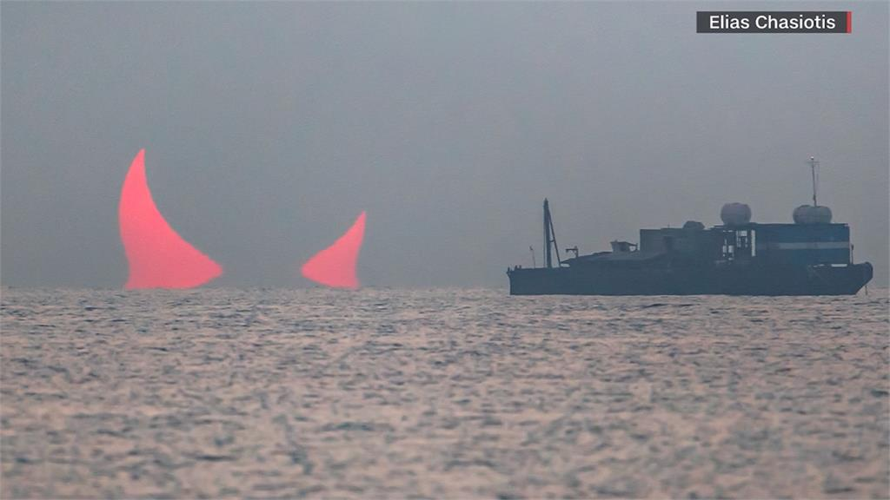

# 波斯湾魅影

2024年6月，波斯湾战云密布之时，美国太空总署公布的「每日一照」，近来引起全球舆论话题。这张照片是一名天文学家日前在波湾上拍到的，不过景象却是「紅色恶魔的双角」，有专家澄清，是日食所致.

1天之前，美国太空总署NASA、FBI与中国国家航天局CNSA，均得到来源可靠的消息，印度洋深海探测到了被未知力量激活的DC本体-海浪头，并正往波斯湾方向移动。

DC海浪头本体形态缓缓冒出波湾，巨浪涌横扫海面， 一座黑色小山一样的巨型方块浮出海面。

一股让人感觉不到的的强大超低频冲击音波（次声波），以DC海浪头本体为核心，无声无息之间发射出来，沿着广阔的印度洋面迅速扩散开去。

转眼间海浪头本体渐渐变的半透明，逐步消失在洋面，双角幻化为波斯湾红色恶魔角景象...

