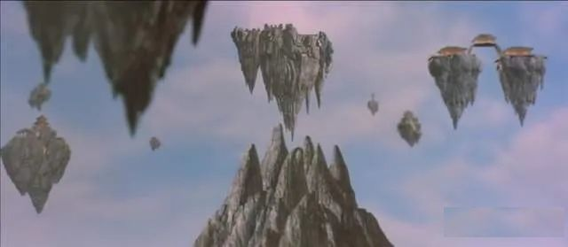

# 地外文明遗迹的崛起

波湾魅影的出现和隐身、启用了暗物质引擎，激发了同弦暗物质宇宙的微弱震荡，DC海浪头呼唤同类的次生波啸叫，很快也到达了峨眉。

峨眉金顶之上，传说中的蜀山忽然出现了，一座黑色擎天巨峰，高宽都在2千多米。

峨眉金顶的游客们震惊到不知所措，接下来突然有人大声呼喊，人群也发出阵阵喧哗，纷纷拿出手机拍摄下云层之上的震撼巨峰。

就在一瞬之间，在暗物质引擎的强大驱动下，蜀山一眨眼重新隐入了暗物质平行宇宙，但就是这短短一刹那，大气层上空出现了一个空洞，太空中多个国家的侦查卫星拍到这一幕，蜀山的存在已无法隐藏，不可避免将引起全球各方的关注。

峨眉市政务热线当天就接到了社会和媒体的多个询问电话，工作人员反应迅速， 第二天景区管委会网站、上市公司公告、地方媒体成都商报均刊登了澄清消息:

“昨日，峨眉山景区管委会联合国内领先的虚拟现实科技团队，在金顶进行了一次精彩绝伦的全息立体虚拟现实表演秀，获得了大量现场游客关注和惊叹，活动取得了预期效果，引发了海量社会关注，为避免社会不实传言，特此说明”。

很快，蜀山事件就平息下来......

同日，一份来历不明的神秘报告，寄到了中国国家航天局CNSA 地外文明研究中心，并快速通报到了国家安全局特情处理中心，汇同中央军委代表，李梅少将立刻启动了临境全息会议系统，召开紧急特情分析汇报会议。

这么多年过去了，一眼看去，李梅少将依旧像个白衣少年，眉宇间强大的气场，让人无法判断他的真实年龄。

李梅带上全息指环，灵活的操纵着临境全息会议系统，把情报影像立刻投影了出来，并缓缓说到：

”根据最新情报，有新的方块遗迹被唤醒，代号海浪头...“

“我们破译了海浪头次声波啸叫，部分印证了情报的真实性”

这份情报打破了一直以来想象中的地球和平，暴露出令人震惊的地外文明竞争情报态势，地外文明遗迹活动迹象已经在全球高频出现，包括了波湾海浪头、峨眉金顶蜀山、美国51区的巨型不明飞行物、月球背面的不明规则立方体、太阳表面的巨型飞行物...。\

根据该情报信息显示：美国NASA和中情局，目前收集确定了600多处高度疑似的地外文明遗迹控制器，已经展开对疑似外星文明的接触研究，并且针对地外文明第四类接触，启动了特别宿主培养计划，目标是培养可以和地外文明深度接触，甚至探索融合的国家特殊人才，代号【特洛伊】计划。\

情报同样显示：俄罗斯、澳大利亚、英国、日本、芬兰等全球10余个国家，以国家名义成立不同形态的研究机构，研究和发掘地外文明遗迹资源。有类似美国宿主培养计划的国家，至少包括日本、俄罗斯、澳大利亚等国。

最让人震惊的是，对中国绝密计划的精准信息也在这份情报的统计列表之中，中国对地外文明的探索储备能力位列美国之后，目前已收集锁定了500多处地外文明遗迹方块和控制器资源，并精确点明了中国地外文明接触人才培养计划，官方代号为【封神榜】。

情报明确无误的告知，地外文明遗迹方块的规模存在和战略潜力，已被一部分国家官方内部确认，地外文明遗迹方块（龙胶囊）正在成为各国争先抢夺的战略资源，而这份情报，很可能被无差别的传递到了全球各国首脑与国防部长办公桌上。

一场史无前例的地球文明进化风暴，已经悄然拉开了帷幕......

