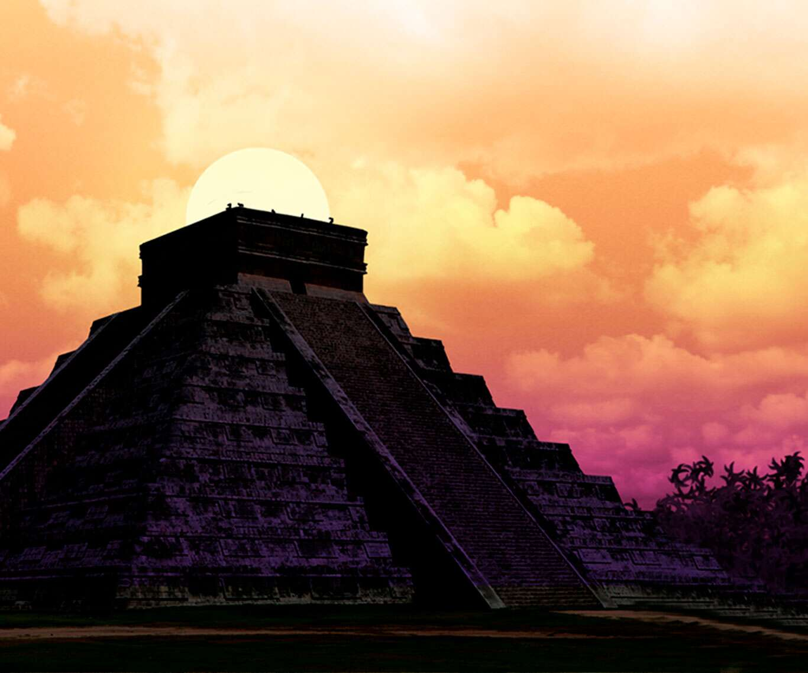
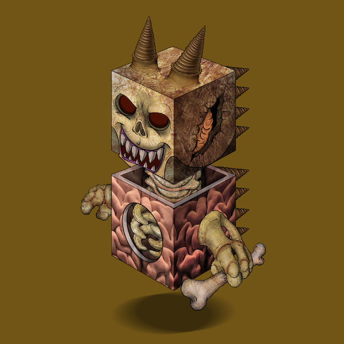
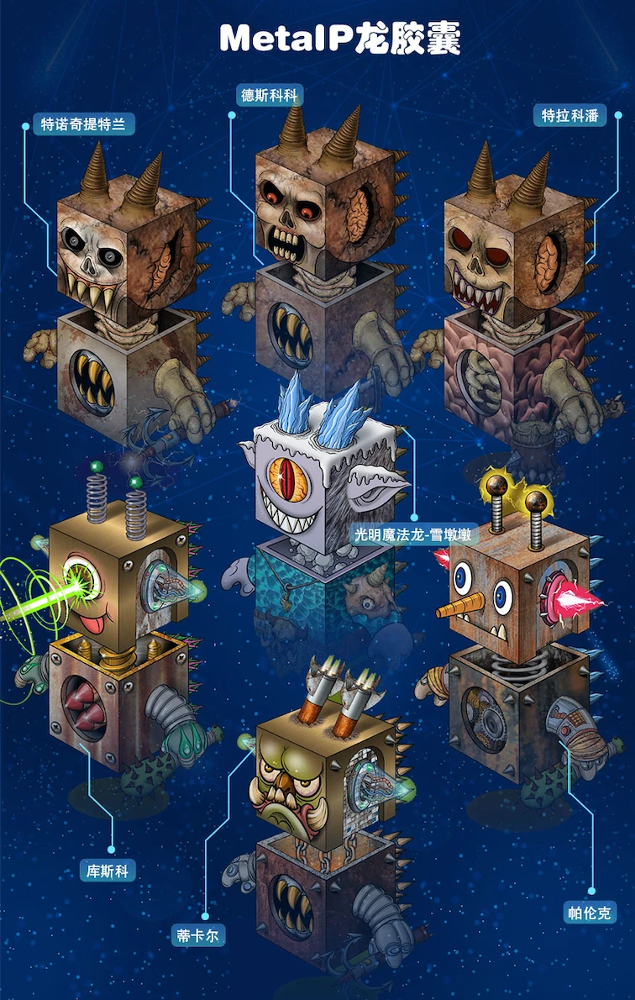

# 玛雅文明

**玛雅文明是世界著名的古代文明**之一，诞生于公元前10世纪，并于公元3至9世纪达到鼎盛，延续了3500多年。

**古玛雅人被公认为伟大的天文学家和建筑师**，他们自诩“卓金星”的天外来客，他们已经实现的预言，他们创作的石板画上有类似“太空飞船”的场景，他们根据恒星运行建造的建筑，他们的数学和天文精准到能让每年9月21日黎明的第一道阳光准确地从太阳门中央射入……给现代人留下了无数绚烂多彩的瑰宝和许多难以破解的谜题。

玛雅人相信万物有灵，认为神明在宇宙中穿梭行驶，指引人们生活。他们崇拜太阳神、玉米神、雨神、五谷神、死神、战神、风神、地神等，认为这些神主宰着人们的农耕和现世的生活，太阳神居于诸神之首。为了博得神明的应许，促进文明的繁衍生息，玛雅人选择在节庆日进行活人献祭，举行盛大的祭奠仪式。

玛雅文明经历了长达三千年的风风雨雨，最后一个城邦在西班牙殖民者的炮火中灰飞烟灭而告终。作为世界上唯一一个诞生于热带丛林而非大河流域的古代文明，玛雅文明奇迹般的崛起和发展、衰落和消亡都充满了神秘色彩。随着玛雅文献的焚烧和销毁，玛雅文明也如千古谜题般尘封在了历史长河中。

公元前3世纪，以墨西哥尤卡坦半岛上，原始部落一个叫虎牙（Tiger teeth）的男人正在被玛雅人的保护神黑豹所追捕。虎牙夺命狂奔，却逃不出黑豹的追杀，走投无路的情况下，一头跳下了丛林瀑布下的深潭；虎牙一头扎入瀑布水底，无意中额头的鲜血激活了潭底沉睡的DC龙胶囊雨林头。虎牙和雨林头结合成了神龙共生体特诺奇提特兰。

特诺奇提特兰的本体是边长600多米的中型骷髅龙胶囊（Skull DC），接下来的八百年间，嗜血的虎牙和特诺奇提特兰同开启了阿兹特克文明，活人祭祀伴随着玛雅雨林文明的光辉繁荣。

美洲古印第安孕育了多个文明城邦，背后除了阿兹特克，还有其他的暗黑骷髅龙和量子矩阵机器龙本体被发现：包括印加文明、玛雅文明，但是如前所述（参考DC龙胶囊档案），由于没有找到光明自然龙使者的护佑，玛雅文明、印加文明、阿兹特克文明背后的暗黑骷髅龙与量子机器龙共生体们，在相互斗争中逐渐沉沦，重新陷入了永恒的黑暗。

.jpeg>)

公元800年前后，古玛雅文明城邦突然走向衰落，许多城市遭到废弃，繁荣一时的玛雅城邦大部分被遗弃在了密林之中。
