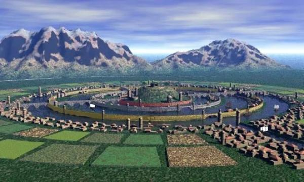
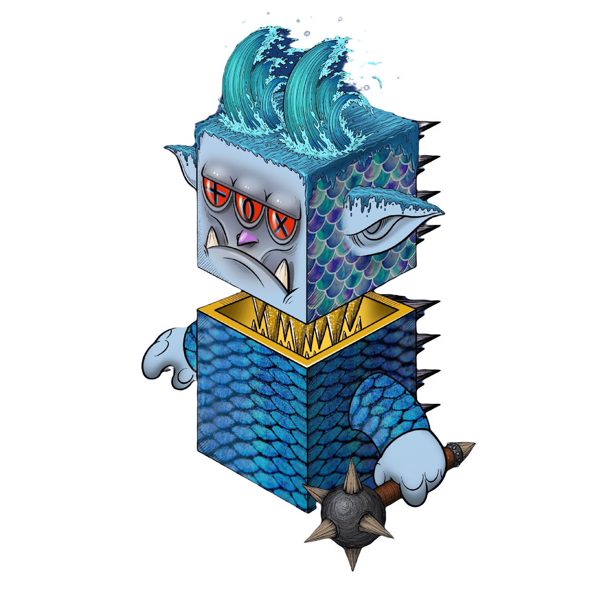

# 亚特兰蒂斯

“亚特兰蒂斯”，英文为“ Atlantis”。**这个名字最早鲜见于古希腊哲学家柏拉图的对话录里**，柏拉图是公元前427年—公元前347年间的人，他在垂暮之年所著的《克里特阿斯》和《提迈奥斯》两本书中提到——

“在梭伦九千年前左右，赫拉克利斯之柱（直布罗陀海峡）对面，有一个很大的岛，从那里你们可以去其它的岛屿，那些岛屿的对面，就是海洋包围着的一整块陆地，这就是‘亚特兰蒂斯’王国”。

“不可思议的奇迹，这座城市由无数个同心圆组成，中心有2个金字塔。每一层同心圆里的街道与建筑，都呈对角线深入大海。海港竖立百米高的灯塔，装饰三辆马车的雕塑。广场有镀金的天文台，太阳神的宫殿，圆形大剧场与竞技场，无处不在的公共浴室。金字塔前的金牛座雕塑，书写着无法理解的符号文字“

三眼海王- Atlantis传奇的渔夫之子亚瑟.库瑞（Arthur.Curry ），历史中海王波塞冬的原型化身，亚瑟在捕鱼时偶然发现了大西洋底的龙胶囊三眼海王，无意中用鲜血激活了它，并和海王结成了神龙共生体，三眼海王的本体是巨型自然龙胶囊（Nature DC），它的黄金塔颈是一座暗能量矩阵，赋予海洋帝国亚特兰蒂斯的无穷洋流的力量，三眼海王那边长足有2公里的龙胶囊本体态，就像一座永不沉没的岛屿。

亚瑟在史书中将海王称为”亚特兰蒂斯“。亚瑟与三眼海王的传奇故事延续了300多年。

亚瑟王像生命般珍爱的恋人“海拉”，在帝国内部的权利斗争中意外死去，亚瑟悲伤至极，失去了生的意愿，三眼海王强烈感受到共生体的死亡意志，曾经光芒万丈的黄金塔能量矩阵渐渐暗淡熄灭，光辉的大西洲文明"亚特兰蒂斯"伴随着亚瑟王的悲伤沉睡，一同沉入大西洋底最深处。

.jpeg>)
