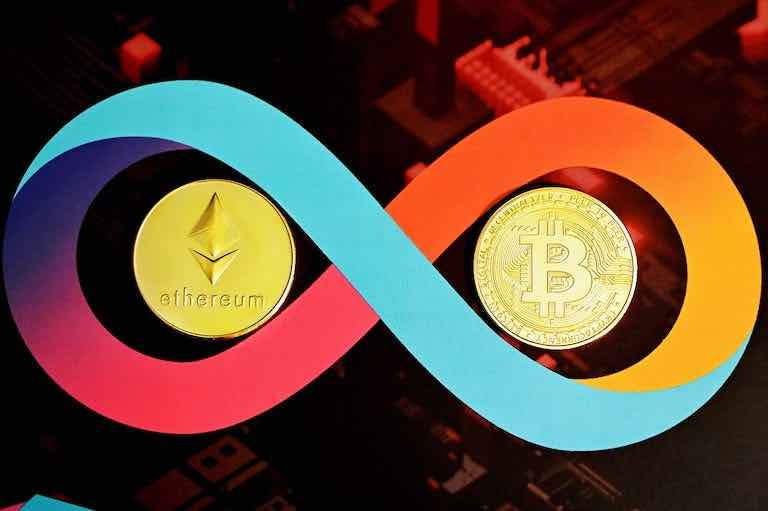
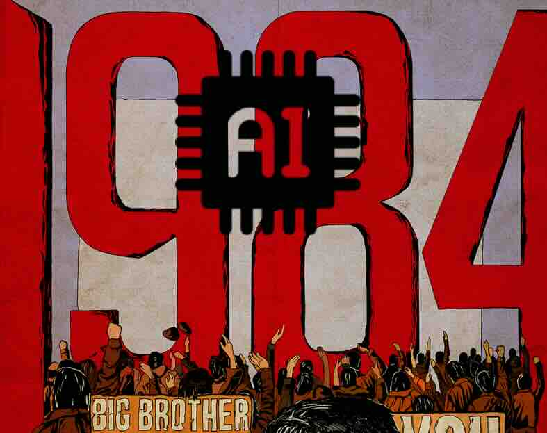

# 加密经济的崛起（2009\~2109）

## 美元霸权的确立（主权货币）

线索得从1944年说起，布雷顿森林协议建立了一个新的国际货币体系,通常称为“布雷顿森林体系”。该体系确立了美元在全球货币体系中的主导地位,开启了一个新的现代货币时代。

1971年8月15日,尼克松宣布美元与黄金脱钩,标志着布雷顿森林体系崩溃。尽管欧洲国家强烈反对美国单方面违反协议,但无力阻止。1973年史密森协议试图保持货币固定汇率也未能成功。从1974年开始,西方国家实行浮动汇率。

新体系为美元本位制。在这个体系下,美元成为真正的国际货币本位、中心货币和**主权霸权货币**,其背后不再有任何贵金属做支撑。美元成为各国最重要的外汇储备,并成为20世纪最成功的货币。

<figure><figcaption>
布雷顿森林体系确立了全球主权货币美元霸权
</figcaption></figure>

## 加密经济的崛起（非主权货币）

纵观人类现代史，可以惊奇的发现，加密货币从时间序列上，完整的伴随着人工智能发展所有重要节点。

1976年，哈耶克完成了他最后一部经济学著作《货币的非国家化》，这部不起眼的小作品，充满了开创性的远见，第一次提出了对自由竞争货币理论的完整构想；然而，哈耶克没有想到这场革命的主角，是来自完全不同空间维度的数字货币。

2008年，传奇的的密码学怪客-中本聪（satoshi.nakamoto）用加密数字货币比特币网络，悄悄开启了Bankless和货币去国家化的加密金融革命。

2022年 ChatGPT 3.5的出现，宣布了早期AI标准 “**图灵完备测试**” 的终结，人工智能进入了**AGI** 跃迁发展的前夜。

2024年1月，在AI数字经济的另一个赛道上，美国证券交易委员会（SEC）批准了现货比特币ETF上市的决定，全球单一数字货币之王“BTC” 已初具雏形，AI驱动的数字经济和加密数字货币天然存在千丝万缕的联系

华尔街巨头敏锐意识到了新物种的诞生，尝试推动与主导人工智能驱动的新数字经济，加密货币作为这场革命的新范式，已经成为房间里的大象, 影响大到无法忽视。

<figure><figcaption>
加密经济的崛起
</figcaption></figure>

很快，全球主要玩家都意识到， 加密经济正在催生超主权的数字货币霸权，新一轮数字金融争霸战刚刚拉开帷幕...

这一次，华尔街金融大鳄依然是最优秀的资本布局先行者，可以看到一条无比清晰的 “**黄金美元->石油美元->比特币美元**” 的国家货币体系路径，推动美元霸权在人工智能驱动的数字金融科技领域不断延续。&#x20;

紧随其后，俄罗斯、中国、日本、英国、加拿大、澳大利亚、印度、欧盟、东南亚、阿拉伯国家、非洲国家...世界的主要经济体成员，均紧锣密鼓的设立了人工智能、超级新能源、高端科技制造... 以及数字经济发展、研究和监管部门，全力推动人工智能、数字经济与实体产业资本整合，加快抢夺全球数字金融时代的话语权和战略资源...

## 超主权货币时代

2055年，Bitcoin 流通市值超过 1000万亿美金，成为全球第一超主权数字货币。 此时BitCoin已经完成了华丽的蜕变，原生比特币 Bitcoin 保留了POW 算法，但是算力已经进化到了量子计算矿机，基于生物基因计算平台技术，内置抗量子加密AI算法。

Bitcoin 区块链系统已经成为全球人工智能网络的金融结算层基础设施，各种Layer2、Layer3...LayerX的染色 Bitcoin 子网络大行其道，原生Bitcoin被抵押到主要AI金融基础系统的底层，市面上流通的Bitcoin已经非常罕见，如果谁拥有一枚原生比特币，那绝对称得上是一个富豪。

彩色比特币们大行其道，被高速交换到二层、三层甚至无限衍生的多种加密网络，用于各种数字应用......,产生无数千奇百怪的AI金融衍生品Defi, 并通过AI系统进行自动化交易和结算，其价值瞬间暴涨上万倍，又或隔夜下跌几千倍甚至归零... 这一切的上层是各国高度发展的AI全真元宇宙虚拟空间。

与比特币网络类似，以太坊（Ethereum ）抵抗住了无数以太坊杀手的冲击，成功进化成为 Layer 1 去中心化基础计算网络，其上承载着无数自动计算和执行的领域AI逻辑应用 ( Layer N)，无数的数据、AI应用、数字资金在这个网络上无休止的自动运行。

<figure><figcaption>
大小麦哲伦星云
</figcaption></figure>

比特币和以太坊系统就像两个相互影响的卫星星云：大麦哲伦星云与小麦哲伦星云，围绕着我们的“银河系”- 全真元宇宙经济体系运转， 这两大加密网系统的应用之间有无数的虫洞通道，无休止的进行着信息、金钱和能量的交换。

## AI 数字生命

在全真元宇宙经济体系中，Bitcoin 为首的彩色比特币 与 Ethereum 为首的衍生Token 成为了虚拟数字空间的超主权货币，推动着全真元宇宙背后的经济引擎无休止的轰鸣...

<figure><figcaption>
英国作家乔治·奥维尔（George Orwell）1949年写出传世经典，政治荒诞科幻小说《1984》
</figcaption></figure>

2085年，人们大量进入元宇宙虚拟空间工作、娱乐，甚至进行电子性爱； 除了生物基因工程、核聚变能源、量子空间计算、太空探索、超人工智能等相关产业，真实世界的经济活动相对增长率逐年下降， 元宇宙的相对GDP在跳跃式上升，人类正在进行全面进入元宇宙数字化金融时代，虚拟经济的产值已经历史性的超越了实体经济产业。

AI 替代了90%以上的基础性蓝领工作，由于人们的生育意愿大幅度下降，2100年，全球实际总人口已经逐步缩减到了70亿大关。

与之对应，公元2100年，发生了一件具有强烈历史预言意义的里程碑事件：“全球人工智能AI驱动且合法登记的数字生命，首次突破 **100亿** 大关......”
