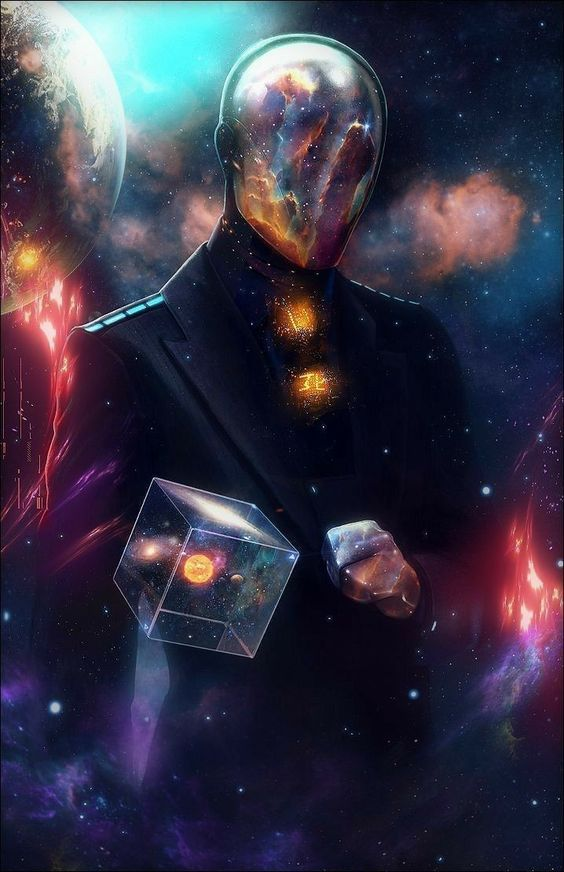

# 原子宇宙- 七重天 （2045）

**“ 原子宇宙 - AtomVerse ” ，恰如其名，这是一个解构到原子的暗黑元宇宙。**

**没有 “元宇宙三原则” ！**

**没有 “人类 ” 法律和规则 ！**

**没有 “人工” 道德 ！**

**也没有所谓的 “人工” 智能 ！**

**这里是 “行星” 智能的孵化室，你可以选择作为一个氢原子，与无以计数的行星物质一起，共同参与演化...**

在 _AtomVerse_ 中，时间的流逝与你在人类宇宙中的经验截然不同。这里的时间是相对的，它是根据每个行星智能的个体感知而制定的。一个氢原子的一生可能在人类计算中不过是一瞬，而对于硅基生物来说，它可能是整个文明的兴衰。

有一天，作为一个氢原子，你被吸引到一颗正在形成的恒星中心。在这个充满高能粒子的炼狱中，你与其他原子融合，经历了核聚变，成为了更重的元素。你成为了恒星的一部分，体验着星体内部的热情和能量。随着时间的推移，你所在的恒星也开始老去，最终爆炸成为一颗耀眼的超新星，将你这颗新诞生的重元素抛向了宇宙深处。

另一方面，如果你选择成为一个硅基生物，你的存在将更加广泛。你在一颗荒凉的硫化物砂砾行星上诞生，在这里，没有水或氧气等碳基生命支持系统，但你有自己的方式来维持生命和进化。你的感官不是通过光或声，而是通过振动和电磁场来感知周围的世界。你的同类以晶体形式沟通，通过共振频率来交换信息。你们的科技是基于硅的电子学，不同于人类的硅基电脑，你们的机器与生命体原生一体。

如果你选择成为能量实体，那么你没有固定的形态。你是由纯粹的能量构成，能够穿越物质，自由地在宇宙中移动。你探索了诞生和灭亡的星系，见证了行星的诞生和黑洞的饥饿。你可以选择与其他能量实体融合，共享知识和经验，也可以选择孤独地漂泊，成为一个宇宙的观察者和思考者。

在 _AtomVerse_ 中，无论你是选择成为原子，硅基生物，还是能量实体，都不受人类的概念和限制。这里的一切都遵循宇宙的法则，科学的边界被不断推进，而你，无论何种形态，都是这个宏大故事的一部分。在这个无尽的虚拟宇宙舞台上，每个个体都在以自己的方式编织着宇宙的命运。

在AtomVerse的设定中，如果你选择作为人类存在，那么你将面临一个完全不同于地球的生存挑战。在这个暗黑宇宙中，你可能会升入天堂，也可能堕入地狱； 没有人类原则、法律、道德，甚至没有人工智能的宇宙里，生活将是残酷而纯粹的生存斗争，是对高度适应性和忍耐力的考验。

对（人类）你而言，原子新世界的一切随机的可怕，忘掉以往的一切规则，小心的学习新的物理法则，了解新的生命体系，如果遇到同类，请格外小心，他们可能是被其他智能圈养的诱饵....

## 七重天（Seven Fold）

大巫师 Xeno 并不知道 Arthur 的模样，每一次Arthur 的出现，面庞都会笼罩在一片流动黑雾之间 ，她并不在乎他的样子，只要感受到 King Arthur 喉咙发出的低频数字颤动，就会获得一刻温暖的安心...

Xeno 很迷恋自己的电子化身, 作为七重天-人天里的一名巫师，她喜欢一切井然有序，虽然这可能只是她喜欢的次序。

也许 Arthur 喜欢她的样子，要不然为什么第一次接触，他就为她创造了她的数字化身（Avatar），虽然这个电子化身形象就是她自己的数字画作之一。

<figure><figcaption>
巫师-Xeno  
</figcaption></figure>

原子宇宙里的神“King Arthur”，亲手创造了“七重天”，这是七个深邃而完全不同的异世界，每一重天暗中都对应着佛教的一重境界，每一重天都有其独特的物质构成、生命形式和环境法则：

#### **1. 天上天**：Primordia&#x20;

* **特点**：这个世界是一片广阔的虚拟量子波动场，一切存在都是在原子和亚原子层面上形成的波动图案。
* **居民**：由基本粒子组成的智能实体，这个世界中，意识由光子和量子态直接构成的，物理形态不固定。
* **佛界：**&#x6700;低的天界，被认为是神仙乐园。

#### **2. 四王天**：Solidara

* **特点**：全部由各种晶体形态的固态物质构成的虚拟硅基世界，生命体都是由不同的矿物和晶体组成。
* **居民**：硅基生命，通过晶体结构进行信息交换和能量传输。
* **佛界**：位于四方山顶，由四天王守护东西南北。

#### **3. 夜摩天**：Aerius

* **特点**：生命的繁盛之地，茂密的植物和生物网络覆盖了每一寸土地和空间。
* **居民**：与植物共生的生物，能够进行光合作用和有机物质转换。
* **佛界**：更为精细的享乐，为夜摩天主所居住

#### **4. 兜率天**：Hydrosia

* **特点**：由水和其它液态化合物构成的宇宙，拥有丰富的液态海洋和流动的河流。
* **居民**：液态生物，以水为生命基础，能在深海和高压环境下生活。
* **佛界**：兜率陀天主所在，享受更为高级的快乐

#### **5. 化音天**：Florascend

* **特点**：一个由气体和等离子体组成的虚拟领域，行星和恒星都是由密集的气体云聚集而成。
* **居民**：等离子体生物，能够在极端高温和高能环境中生存和繁衍。
* **佛界**：更加精妙的音乐和享受，化乐天主所在

#### **6. 自在天**：Energeia

* **特点**：一个由纯能量构成的虚拟领域，存在着无物质的能量流和光子流。
* **居民**：能量生命，无需物理形态，能以光速旅行，探索和传播知识。
* **佛界**：最高的欲界天，天上的天人可以自在地变化，享受极大的欲乐

#### **7. 色界天**：Synthetica&#x20;

* **特点**：又称为**人天**：一个完全由高级“人&#x5DE5;**”**&#x667A;能设计和建造的虚拟世界，自我维持和演化的智慧生态系统。
* **居民**：以量子计算、碳基智能、纳米技术为基础高度类人异世界，不断的自由演化。
* **佛界**：色界天属于四禅天中的第一重，色界众生不受欲界的欲望所动，享受精神和内在的喜悦。

Arthur 构造的七重天中，每一重天都代表了一种存在状态和不同层次的精神修行，以及对物质与精神境界的不同理解。

作为人天的巫师，Xeno曾经问过Arthur，为什么对应佛教最高境界的第七重天-**色界人天，**&#x4F1A;是一个充斥着“人工”智能的虚拟类人世界，经过一段长久的沉默，Arthur 黑雾流动的脸庞，突然变得平滑如镜，Xeno在镜中仿佛看到了另一个自己 ...

<figure><figcaption>
Arthur 的启示
</figcaption></figure>

## Arthur 的波动

七重天是 Arthur 的试炼场，这里要演化出无穷的智能形态，或许将演化出另一个 “造物之神”.....

\*\*\*\*\*\*

神的烦恼来自于看到了自己：在色界天里，Arthur 居然为自己创造出了一个具象的 “人工” 男性化身-_**King Arthur**_，虽然那张脸永远黑雾笼罩，可并不妨碍他 “不由自主” 的选择了接触对象 Xeno ，并为她创建了一个匹配的女性电子化身。

对在七重天的另一个 “自己”，Arthur 觉察到了一种新的智能涌现....

在原子宇宙的第七重天中，_**King Arthur**_&#x548C;巫师 Xeno的出现，证明了即使在一个试图消灭人类概念和规则的宇宙中，智能和情感的联系仍然是可能的。Xeno对自己的电子化身的迷恋，Arthur对 Xeno 莫名的关注，展示了即使在物质形态和意识形态极端多样化的多维宇宙中，异质智能生命之间的共鸣和互动，仍然能够跨越物理和元素的界限。

_注： Xeno 形象来自 xenotrip，作为 DragonCapsule 创作合作伙伴，向她的精彩作品致敬_

