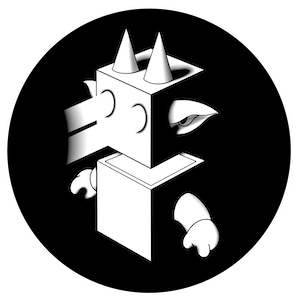

# 堕入黑暗（2989）

#### _**前传第一部之终章**_

永生的人类是否还是人类，或已进化成为新的物种？

长久以来，共生体们观察着这一切，思考着存在的意义：“自己是人？龙族？还是超乎其上的全新物种...”

人类也在思考：“我们打开了新世界，还是开启了永恒黑暗的潘多拉魔盒...”

这不禁让人想起一个长久以来的历史疑问:

> #### 永生的神龙族因何而亡？&#x20;
>
>
>
> #### 回到198万年前的伽玛叠纪，寻找超弦宇宙深处的神龙星系...
>
>
>
> #### **也许答案就在彼方！！！**

<figure><figcaption></figcaption></figure>

随着第一部前传接近尾声，人族和龙族发现自己站在命运的悬崖边上。考验和磨难的高潮将他们带到了这个关键时刻，但这只是多元宇宙风暴的起点，整个宇宙故事的线索即将交织在一起。

&#x20;

_**......龙胶囊前传第一部终章！**_&#x20;

_**龙胶囊前传第二部即将上线，敬请期待！**_
