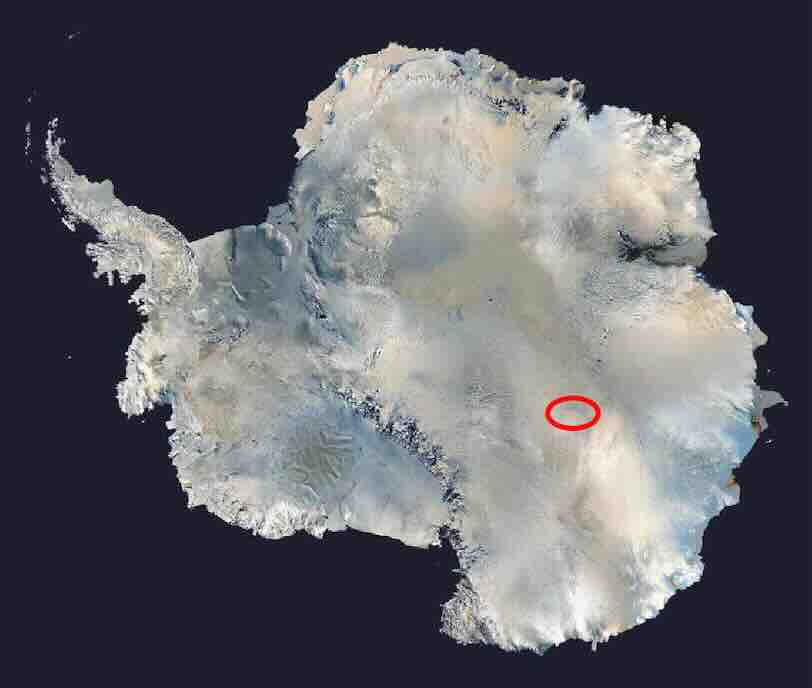

# 温柔的夜（2148）

南极洲，永恒的冰雪大陆，面积约为1300万平方公里，永久封冻的冰原之下，覆盖着2000\~4000米厚的巨型冰盖。

位置在南极内陆，伊丽莎白公主地，东方站（Станция Восток，又称沃斯托克科考站）以西1800米处。

<figure><figcaption>
东方站 Станция Восток 又称沃斯托克科考站
</figcaption></figure>

从直升机上远远望去，在夏日和煦的阳光照射下，一大片狭长壮观的蝴蝶状银灰色图案赫然出现在冰原之上，宽约1-2公里，长度绵延5\~6公里，密集覆盖着大量银光闪闪的可收缩式太阳能单元，一簇簇的呈同心圆形分布，像巨型蝴蝶翅膀上大大小小的圆形巨眼，规模十分惊人。这些最先进的极地光伏发电装置，和向日葵一样，自动朝向太阳，在漫长的极夜来临之前，贪婪的吮吸着每一滴阳光的能量。

东方站4000米厚的冰层之下，隐藏着世界最大的淡水湖泊- 沃斯托克湖（Lake Vostok），面积15,690平方公里，与安大略湖大小相当，这里平均水温为−3℃，在厚重冰层的巨大压力下，湖水仍以液态存在，有极高的氮、氧气浓度含量。（氧气浓度为一般淡水湖泊的 5000%）

在这片永恒黑暗的海洋世界中，依然有少许光亮存在，那是十艘巨大的球状潜艇，在漆黑的沃斯托克湖中自主悬浮游弋，闪烁的航标灯在黑暗中格外显眼，不断有奇异的生物在灯光前掠过，巨大的柔性悬浮线缆连接着潜艇，并通向冰面。

每一艘球形潜艇都是一个巨型蜂巢，密集承载着1万只生命胶囊，不间断的监控维持着胶囊生命功能的正常运行。

...... ...... ......

超弦宇宙的次元膜空间中， 富士一号石原尤加利和富士二号黑龙，复兴神龙族的强大意念波感染了女蜗，作为光明魔法龙，在族人的利益面前，女蜗此刻如此脆弱。东方站冰川下的时间牧场，汇聚了10万个人类意念体的量子矩阵，正形成巨大的暗宇宙能量场涡流。

能量场等待着女蜗的意念，一旦激发，涡流瞬间释放出巨大暗宇宙能量波将席卷全球，人类将被彻底控制，成为神龙族重新崛起的垫脚石....

情感-人类的最基本元素，也是地球赋予龙胶囊共生体的最珍贵礼物，她将何去何从 ？

一年后，女蜗终于苏醒了，她已经做出了最终选择......
