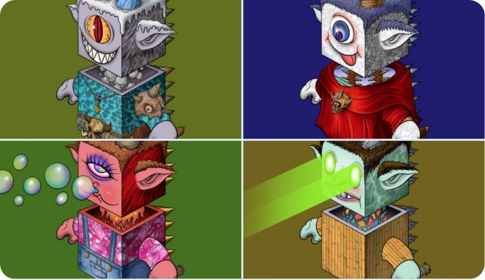

# 龙胶囊档案

## DC规格

每个龙胶囊都是独一无二的，并由381种可能的特征属性以编程方式生成，包括表情、魔法角、服装、装备等。 生成的龙胶囊有上百万种，发行版本仅有随机的10000枚，包含一枚原始龙胶囊彩蛋，所有的龙胶囊都是孤品，但有些龙胶囊比其他的更稀有。

\

## **龙胶囊档案**

* **自然龙 Nature Dragon**

| 特征 | 数量 | 属性说明                                                                                                                                    |
| -- | -- | --------------------------------------------------------------------------------------------------------------------------------------- |
| 龙鳍 | 17 | 龙鳍是空间履行的必要装备，不同的龙鳍具备不同的能力，有的龙鳍可能是天线、有的龙鳍能划破多维空间，通过空间裂缝穿行多维宇宙                                                                            |
| 龙身 | 40 | 龙胶囊坠落到地球后，与不同的自然环境结合，产生了不同的龙头、龙身和纹理，这些纹理代表了自然界的各种元素，也具备自然界的各种力量                                                                         |
| 龙头 | 39 | 龙头和龙身一样，是与自然结合的神奇生物                                                                                                                     |
| 龙颈 | 20 | 自然龙从植物、动物、岩石、气候、环境吸收力量，龙颈是能量转换的通道                                                                                                       |
| 表情 | 48 | 自然龙是高度文明进化的产物，有各种各样的个性，表情代表他们的性格，                                                                                                       |
| 龙角 | 27 | 
自然龙天然具有保护环境的意识，这是他们统治神龙大陆力量的来源，龙角具备各种自然元素属性，也是自然龙吸取自然力量的来源，龙角自然元素属性：

“冰山、岩石、森林、野兽、天火、闪电、极光、龙卷风、巨浪、草甸、丘陵、荒漠、多肉植物、矿石、野火..."等
 |
| 服饰 | 10 | 
这些外表普通的衣服只有极少数自然龙具有，平凡的外表下具有不同的神奇功能，比如:

“功夫唐装、美杜莎背心、瞬移毛衣...”等等
                                                             |
| 装束 | 18 | 
少数高级自然龙的装备，包括

"法袍、骷髅龙法器、龙之战衣、飞行夹克、吞噬T恤、魔术西装、维京人战服、火龙帽衫..."等等
                                                               |
| 武器 | 15 | 自然龙的武器包括：“雷神之锤、死光剑、维京战斧、闪电之矛...”等等                                                                                                      |

\

* **机器龙 Robot Dragon**

| **特征** | **数量** | **属性说明**                                                              |
| ------ | ------ | --------------------------------------------------------------------- |
| 龙头     | 10     | 龙胶囊坠落到地球后，与不同的金属结合，产生了不同的龙头、龙身和纹理，这些纹理代表了各种金属元素，具备各种机械的力量，也是机器龙的主控制单元 |
| 龙侧     | 12     | 机器龙侧是能源光合板，机器龙高效供能单位                                                  |
| 龙耳     | 5      | 机器龙耳具备多种功能，包括“量子天线、高周波雷达、暗物质光线传感器...”等                                |
| 龙颈     | 5      | 机器龙颈是能量和数据传输的总线，也是机器龙的阿喀琉斯之踵                                          |
| 龙身     | 20     | 机器龙胶囊与不同的金属结合，产生了不同的龙头、龙身和纹理，这些纹理代表了各种金属元素，具备各种机械的力量，也是机器龙的能源核心和引擎    |
| 龙角     | 8      | 机器龙天然具有战争的意识，龙角和龙腹包括了这些战争装备                                           |
| 龙臂     | 3      | 具备赛博空间和机器文明的操纵能力，包括虚拟现实、空间压缩...                                       |
| 龙手     | 5      | 具备赛博空间和机器文明的操纵能力，包括虚拟现实、空间压缩...                                       |
| 铆钉     | 3      | 机器龙的量子大脑的连接部件，容纳在这些小小的铆钉里                                             |
| 龙腹     | 6      | 龙腹是机器龙的主要武器                                                           |

\

* **骷髅龙 Skeleton Dragon**

| 特征 | 数量 | 说明                                                   |
| -- | -- | ---------------------------------------------------- |
| 背鳍 | 1  | 龙鳍是空间履行的必要装备，不同的龙鳍具备不同的能力，骷髅龙鳍能划破多维空间，通过空间裂缝穿行多维平行宇宙 |
| 龙头 | 10 | 连接多维暗宇宙，产生了不同的龙头、龙身和纹理，这些纹理代表了暗宇宙的各种元素，也具备暗宇宙的各种力量   |
| 龙角 | 1  | 龙角是骷髅龙的暗宇宙信号发生器                                      |
| 表情 | 3  | 骷髅龙是无感情和无善恶的，他们的表情只是暗宇宙赋予的表象                         |
| 龙耳 | 3  | 骷髅龙耳直连大脑，收集暗宇宙的信号                                    |
| 龙手 | 1  | 骷髅龙手具有操纵宇宙熵的潜在能力，这样的能力在整个龙族里是独一无二的                   |
| 龙身 | 7  | 连接多维暗宇宙，产生了不同的龙头、龙身和纹理，这些纹理代表了暗宇宙的各种元素，也具备暗宇宙的各种力量   |
| 龙腹 | 1  | 骷髅龙腹代表暗黑空间的力量                                        |
| 武器 | 1  | 骷髅龙武器是上古龙族的暗黑龙之骨                                     |

\

* Create by @YieldDAO Labs, All Rights Reserved.

